# Visualization of the Comparative Climatic Data

I live in Charlottesville, VA. It's cloudy all the time, but I love sunny days. I wonder which us city has the best climate according to my preference, so I visualized the [Comparative Climatic Data](https://www.ncei.noaa.gov/products/land-based-station/comparative-climatic-data).

[YouTube Video](https://youtu.be/2L0IhXjtXRs)

# Usage

```sh
python locate.py
python visualize.py
```

Generate images are at `figures` folder.

# Results

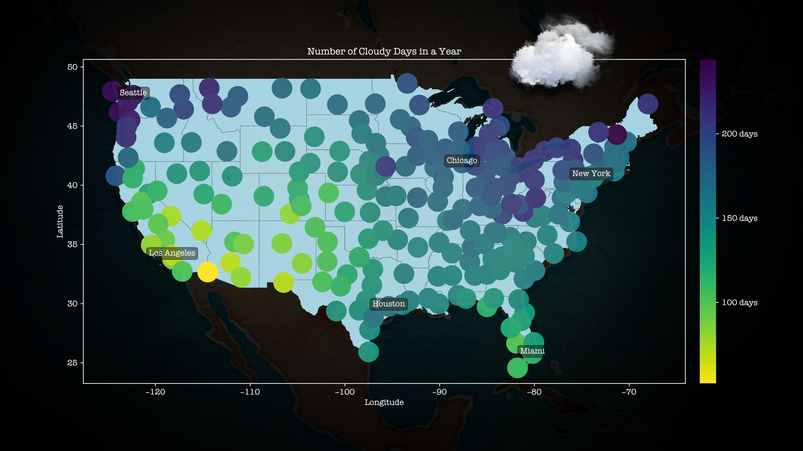

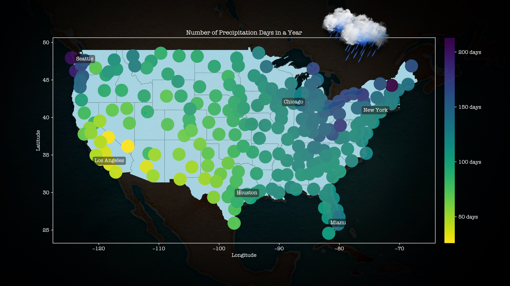

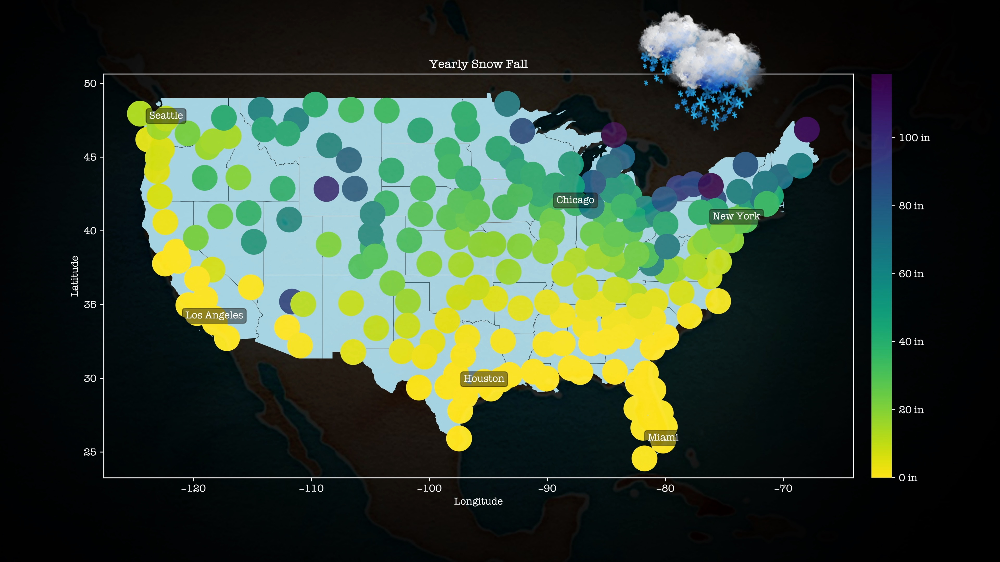

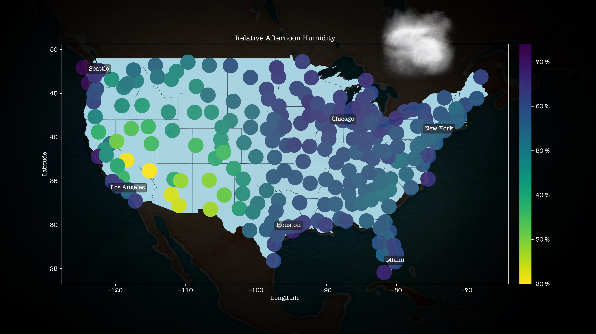

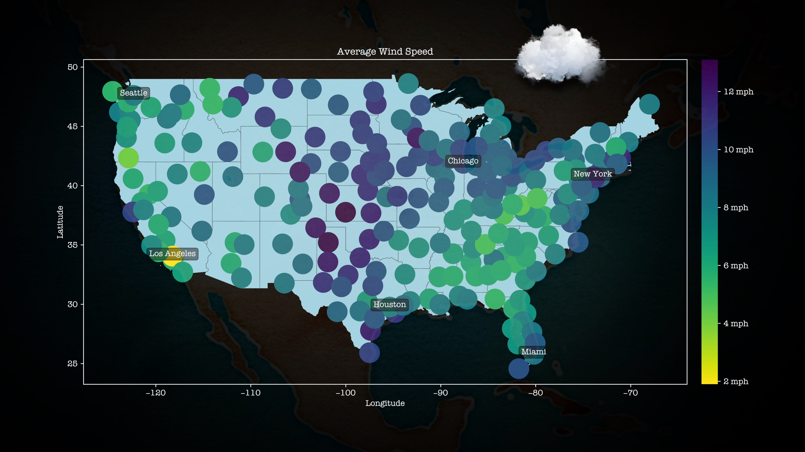

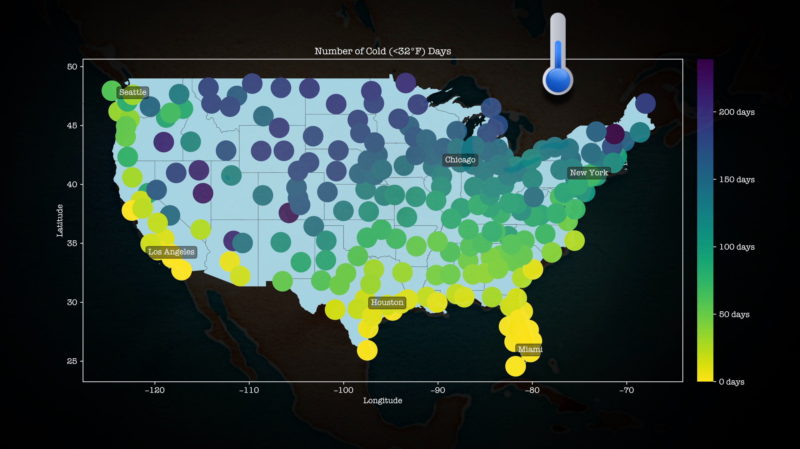

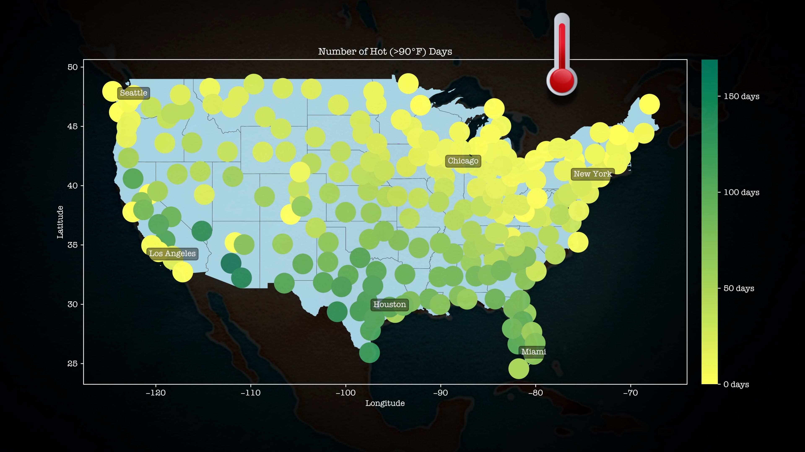

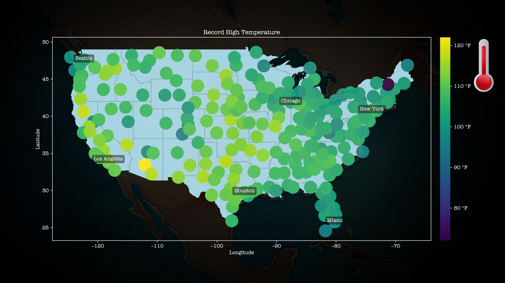

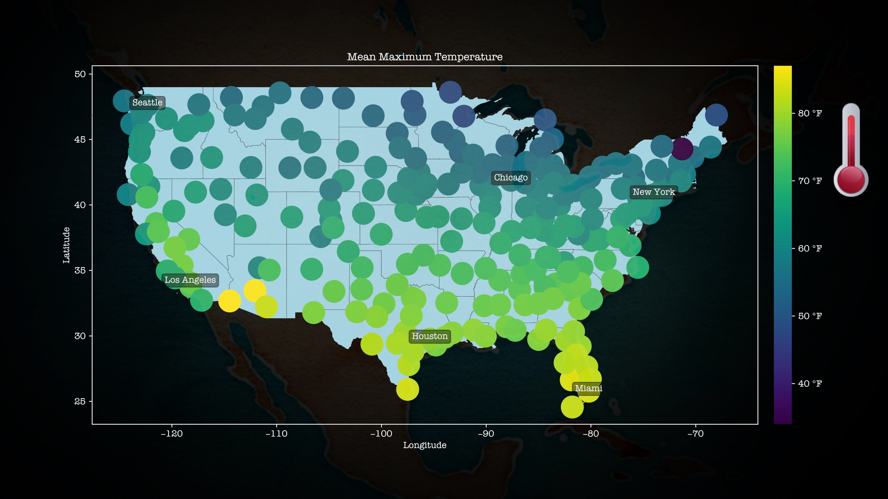

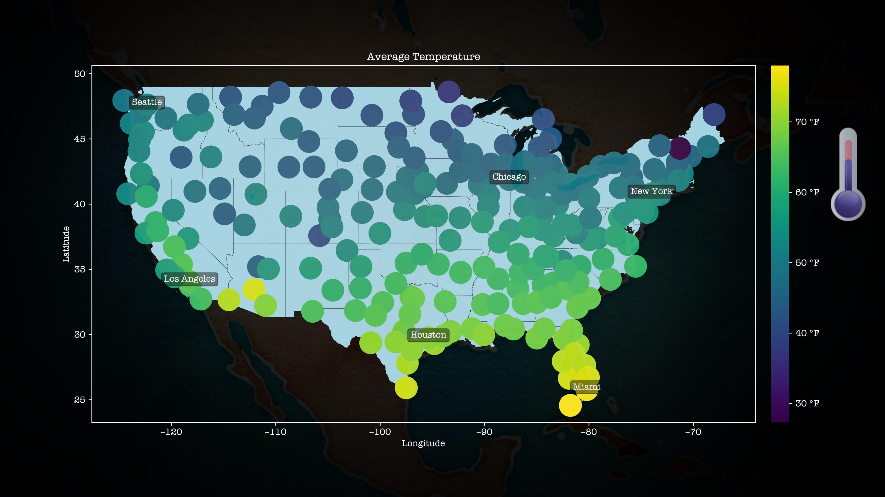

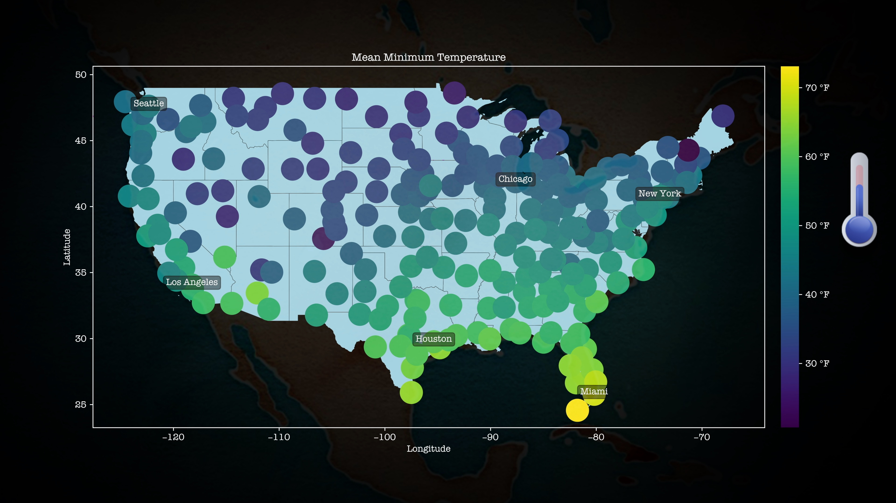

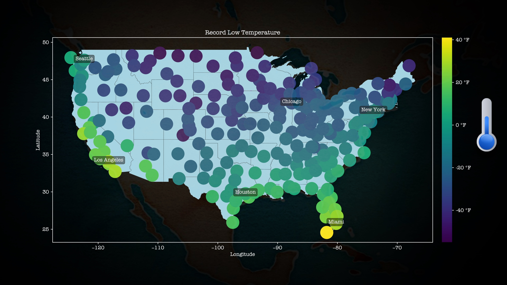

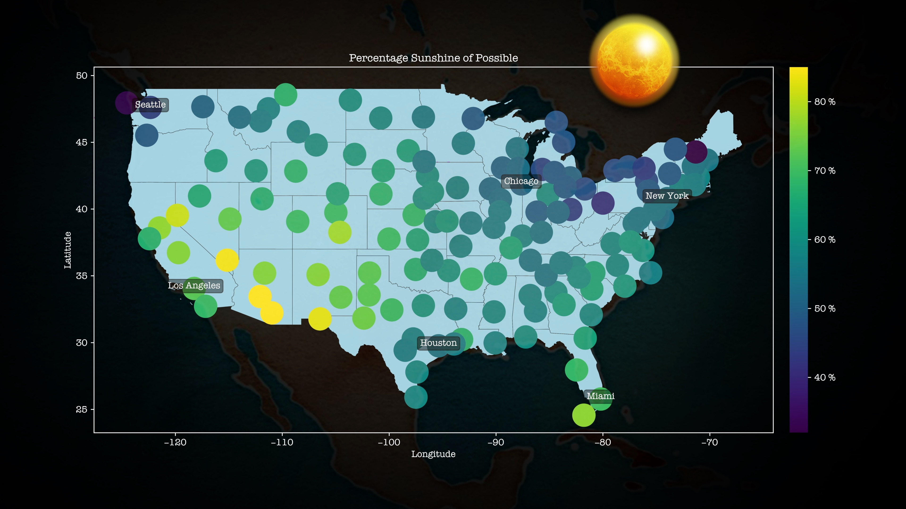

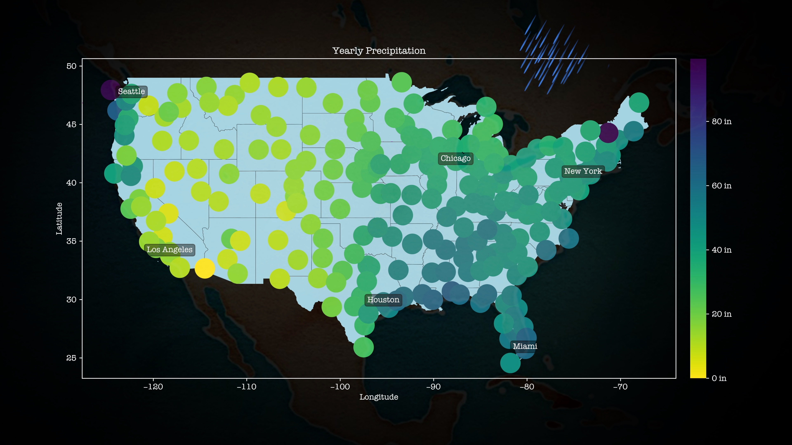

# Acknowledgements

[Comparative Climatic Data](https://www.ncei.noaa.gov/products/land-based-station/comparative-climatic-data)

[US Census Shapefiles](https://github.com/joncutrer/geopandas-tutorial)

[Qweather Icons](https://github.com/qwd/WeatherIcon)

[Stamen Watercolor Map](http://maps.stamen.com/watercolor/)

Art supervisor: tbZ

Nuvole Bianche by Ludovico Einaudi

Youtube Audio Library

Edits in Adobe Photoshop and iMovie
