# todo

https://www.youtube.com/watch?v=ll5s3vlVlmA

# Visualization of the [Comparative Climatic Data](https://www.ncei.noaa.gov/products/land-based-station/comparative-climatic-data)

# Usage

```sh
python locate.py
python visualize.py
```

Generate images at `figures` folder

# Results

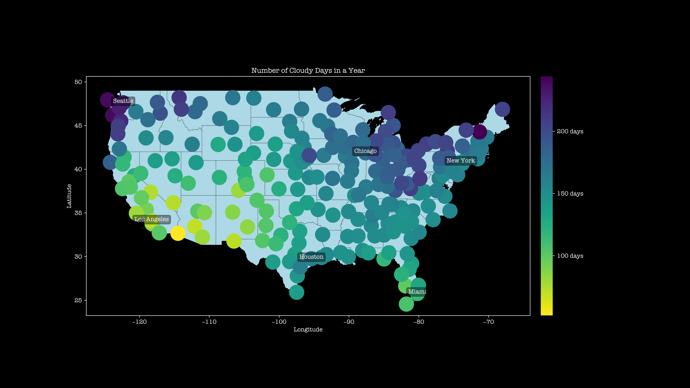

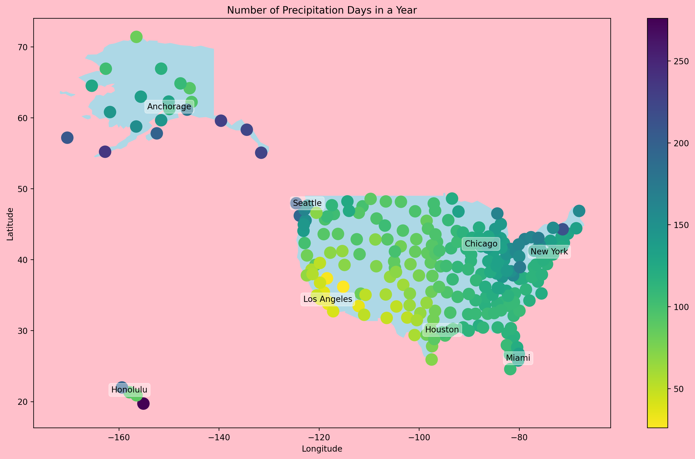

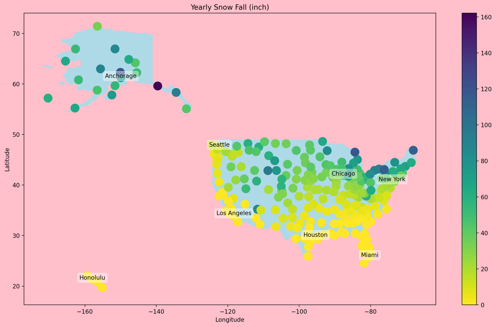

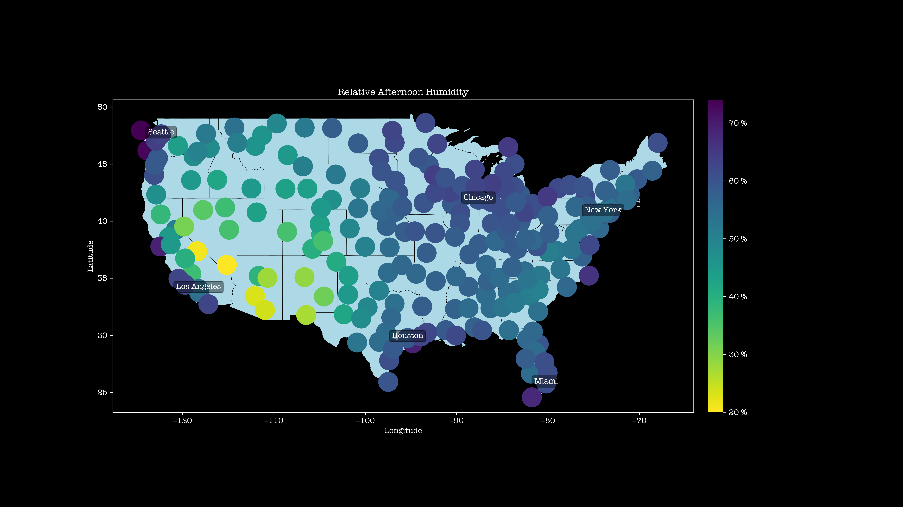

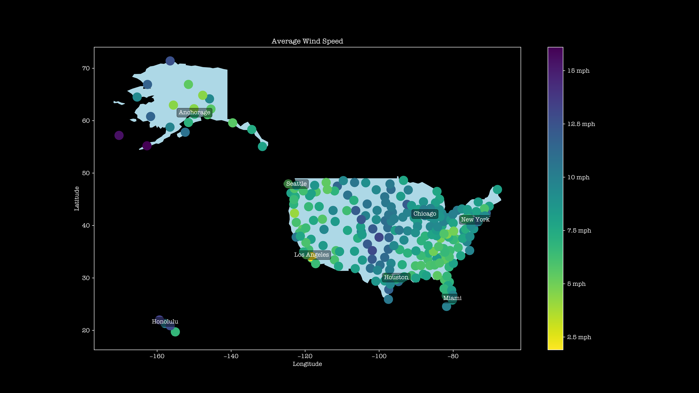

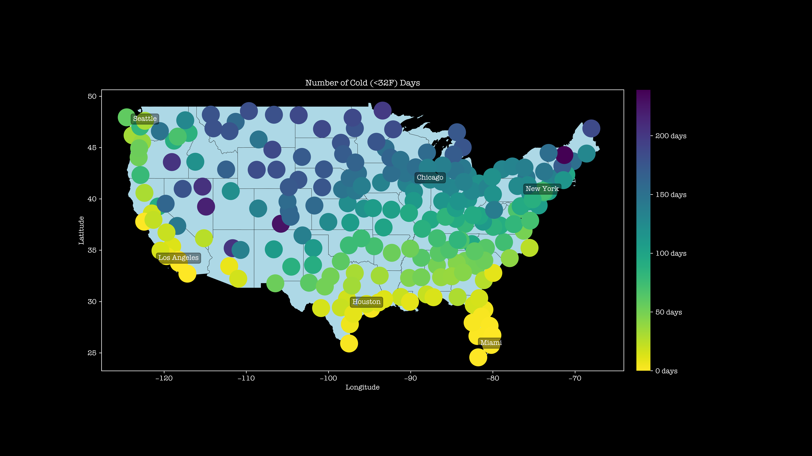

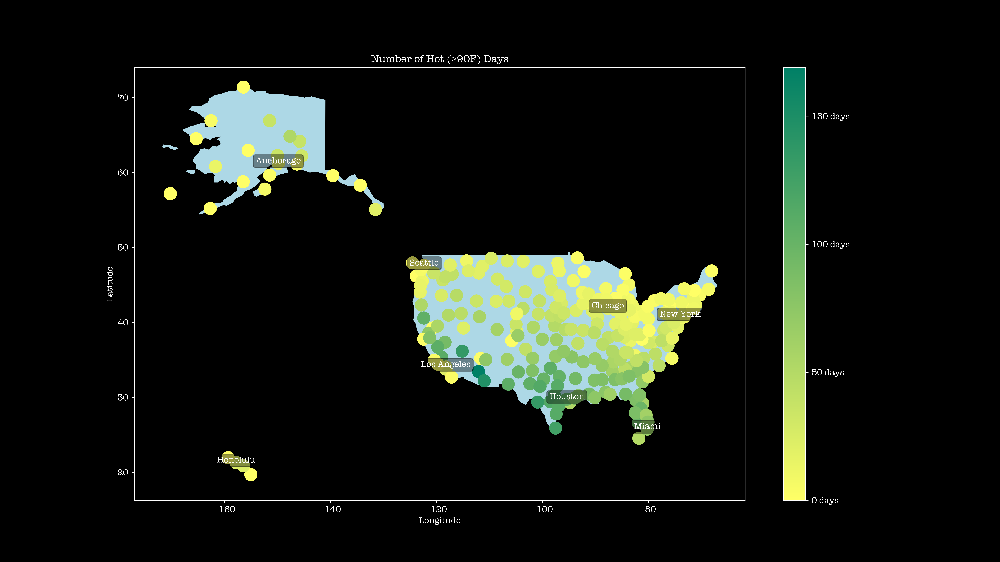

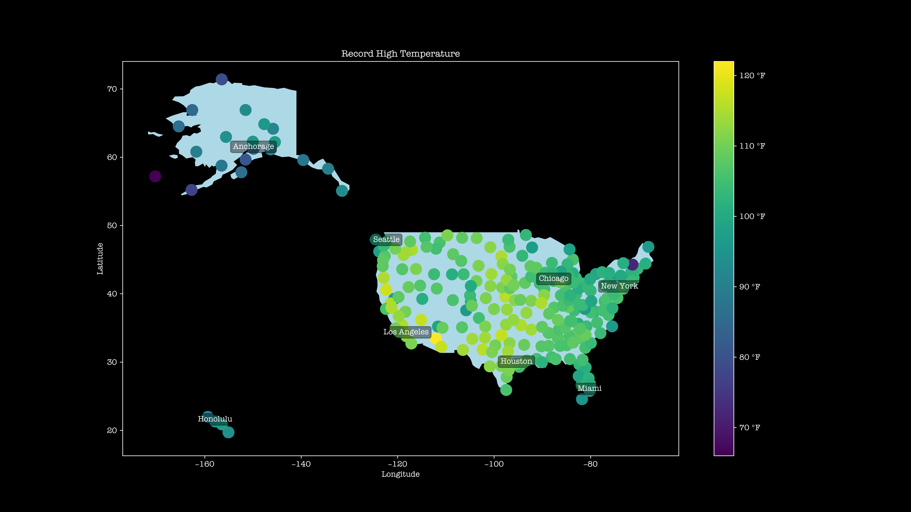


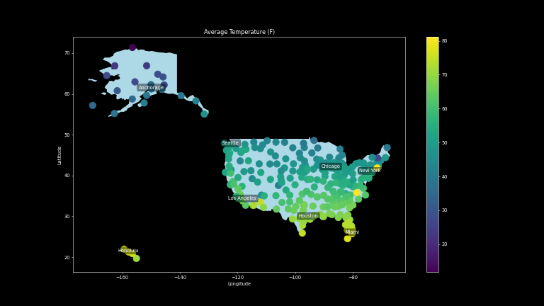

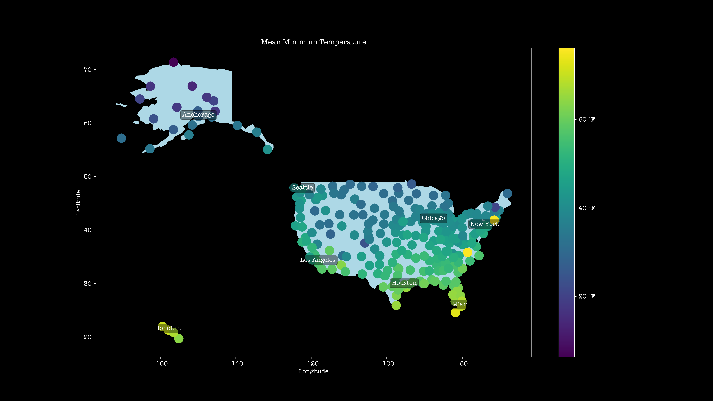

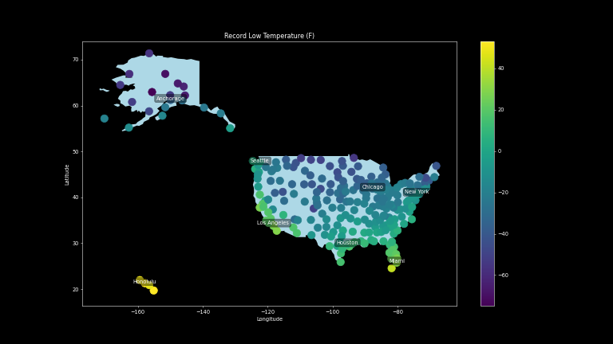

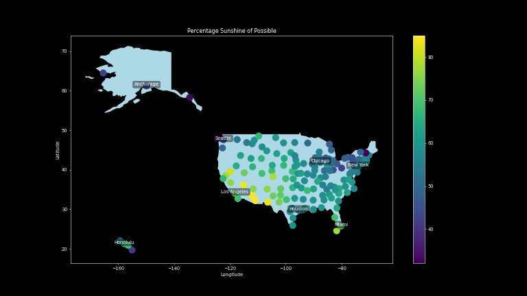

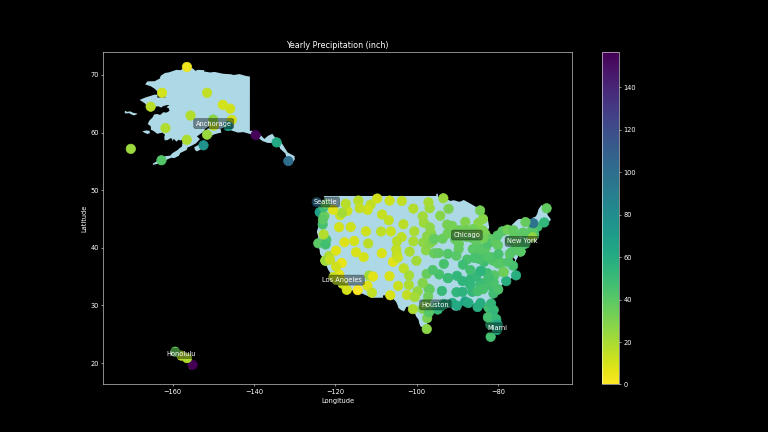
