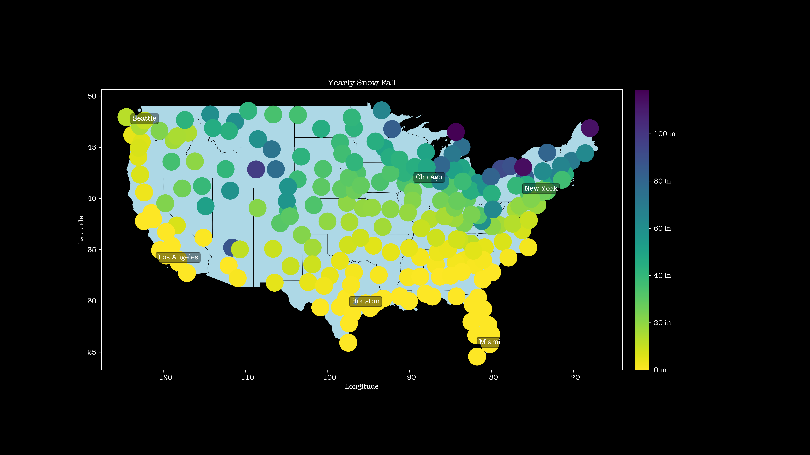
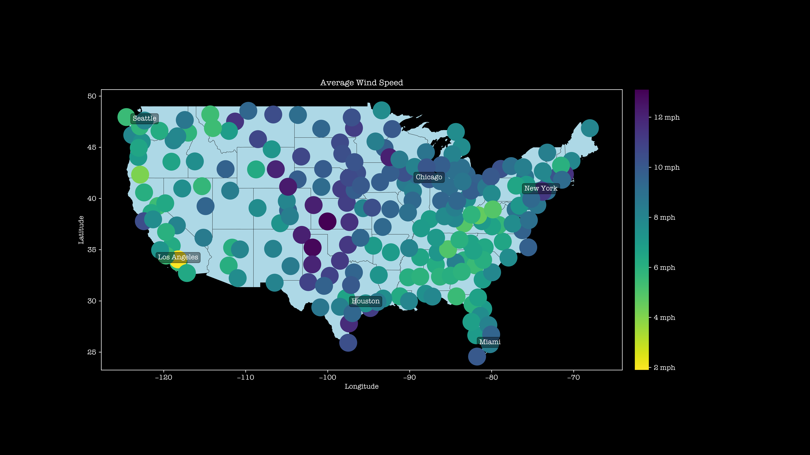
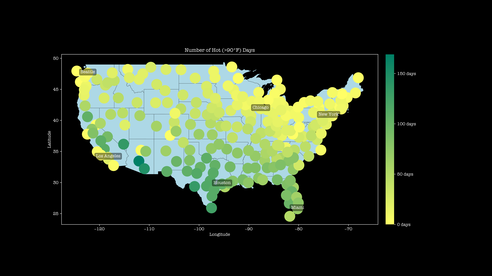
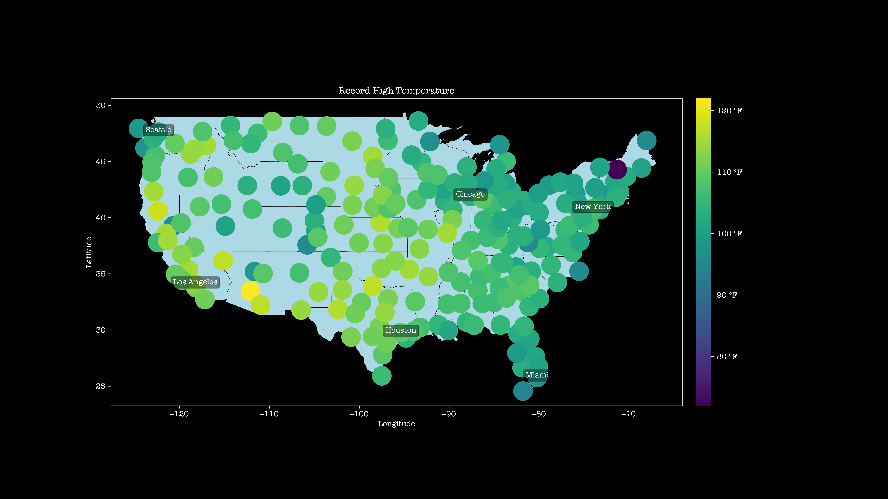
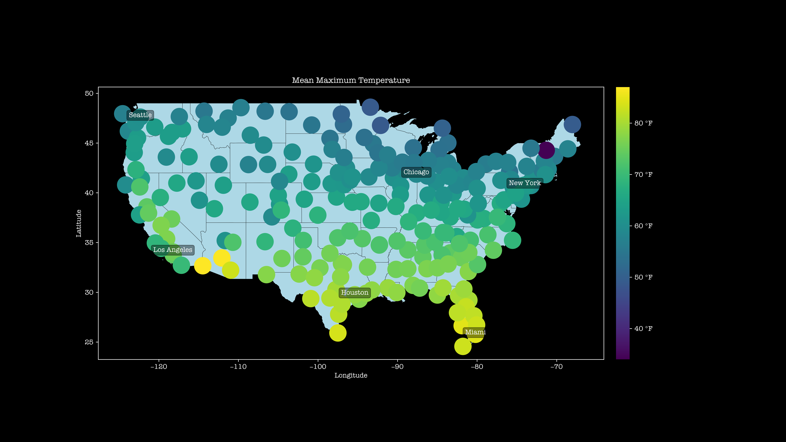
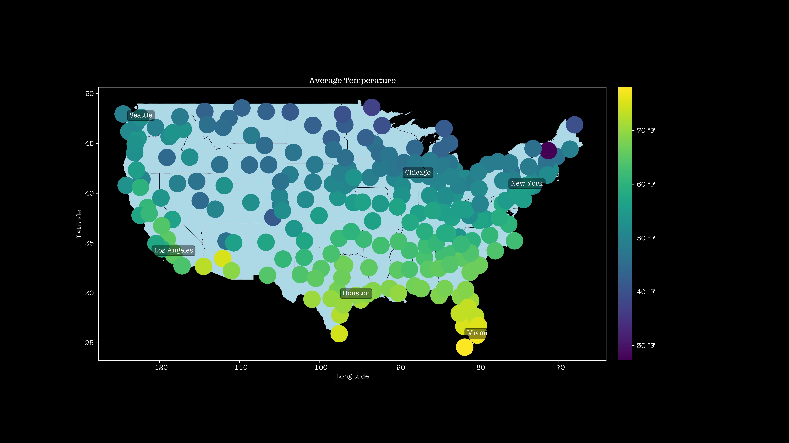
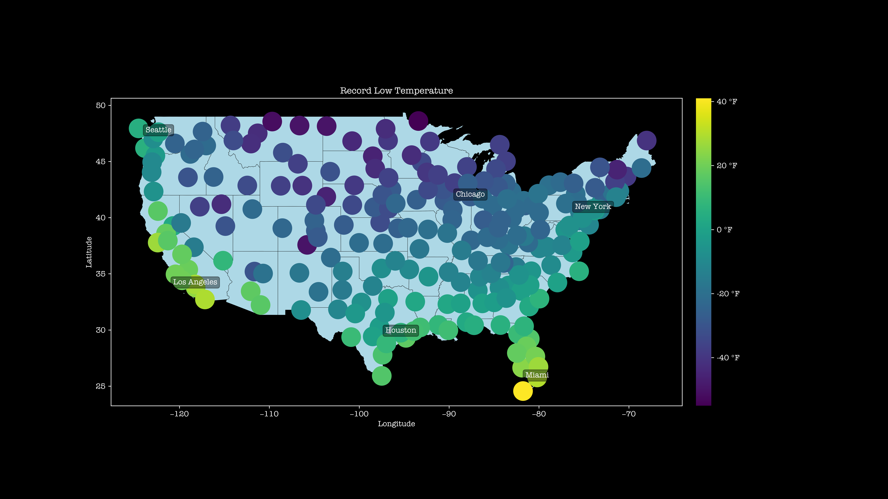
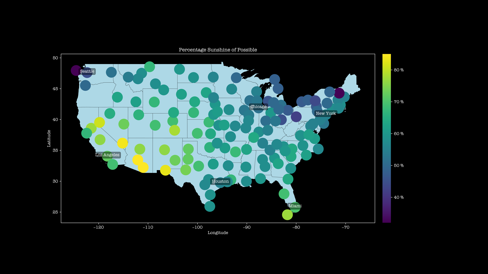
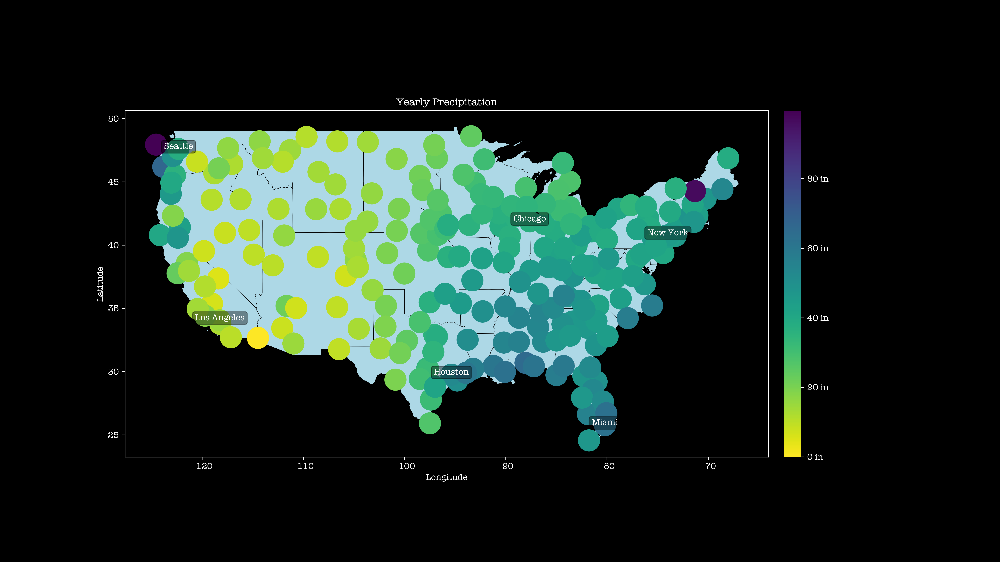

## Visualization of the Comparative Climatic Data

I live in Charlottesville, VA. It's cloudy all the time, but I love sunny days. I wonder which us city has the best climate according to my preference, so I visualized the Comparative Climate Data.

[Comparative Climatic Data](https://www.ncei.noaa.gov/products/land-based-station/comparative-climatic-data)

Also take a look at the `artistic` branch!

# Usage

```sh
python locate.py
python visualize.py
```

Generate images are at `figures` folder.

# Results






















